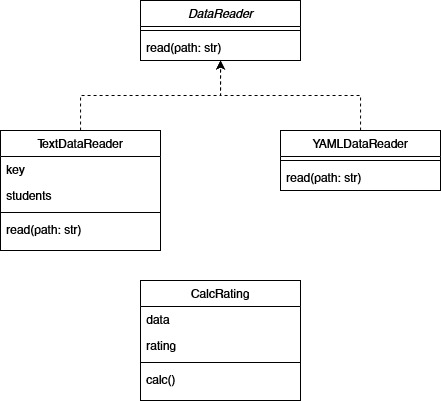

# Лабораторная 1 по дисциплине "Технологии программирования"

Вариант №9

Задача:
Определить и вывести на экран студента, имеющего 90
баллов по всем дисциплинам. Если таких студентов 
несколько, нужно вывести любого из них. Если таких 
студентов нет, необходимо вывести сообщение об их 
отсутствии.

Используемые языки:
- python 3.9.

Используемые библиотеки:
- pytest;
- pycodestyle;
- pyyaml.

UML-диаграмма классов:

Выводы: В результате выполнения работы был реализован функционал описанный в индивидуальной задаче